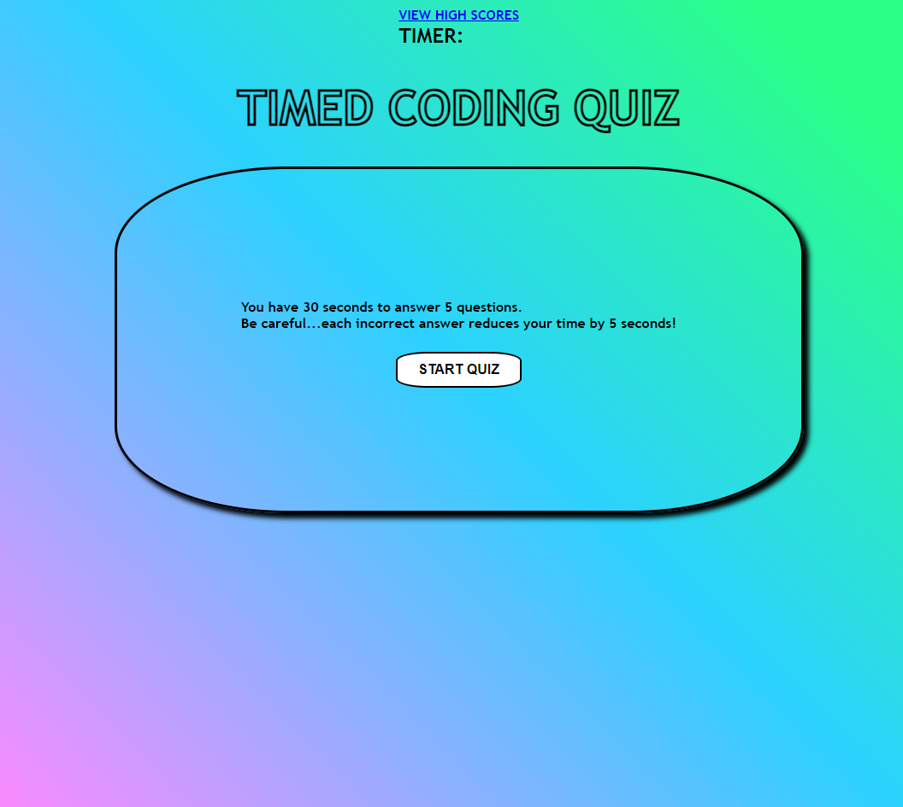

# CODING QUIZ

# Link

https://williamgeorgethomas.github.io/coding-quiz/

# Purpose

This application was created to make a multiple choice quiz.  Users have only 30 seconds to take the quiz and each incorrect answer reduces the time by 5 seconds.  After completing the quiz, users can enter their name to record their score.  The top 5 scores are displayed when the user clicks the "VIEW HIGH SCORES" button.

# My Experience

Building this application from scartch presented many challenges.  It required extensive use of JavaScript, a language I am still in the early stages of learning.  It took extensive testing, revisions, and help to complete the application.

# Screenshot

# Credits

Created by William George Thomas, 2022